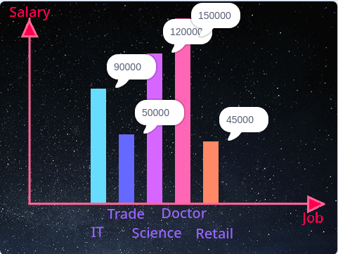

This tutorial introduces you to lists, a popular types of data structure. It shows you how to create a list, add items to a list and read from a list in Scratch. More, it shows you how to create a graph from a list.

<!--more-->

# Introduction

Data structures are the way computers store its data and information. There are several different kinds of them. You have learnt about variable in Scratch which a variable can store a number or a string (i.e. text), for example `set (my age ) = 12` or `set (my name) = Bumblebee`. Similar, a list is a variable which can store more than one value.


# Working with lists

## Create a list

To create a list, from Scratch open **Variables** and select **Make a List**. Give it a meaningful name.
<!--  -->

## Add items to a list

Once you have created a list, you can add items to your list by this block `add (thing) to [your list's name v]`. Here is an example:
<!-- . -->

Each item in a list is indexed, meaning its position is identified by the index. The first item has index 1, the second is 2 and so on. To add an item, say at position 3, you can use `insert (stuff) at (3) to [your list's name v]`. This block will move everyting from position 3 to the end one more step and add *stuff* to **your list's name**  at position 3.

## Delete items from a list

Deleting an item from a list is easy. You just need to know its position and use the block `delete (position) from [your list's name v]`.

## How to read all items from a ist

It's simple, use a loop and an index. First, create a variable and called it **index** (or something else, its name is not important). Then use a `repeat until` block to loop from the list. See the code block below.

```
set (index) to 1
repeat until <(index) = ( length of [your list's name] )>
    say ( item ( index ) of [your list's name])
```

This is how we read a list from top (beginning) to bottom (end)

**A challenge for you. How to read a list from bottom to top?**

# Build a graph with list

Now, we use list to make a graph of Jobs versus Salary of a table below:

| Job | Salary ($) |
|-----|--------|
| IT  | 90000 |
| Trade | 50000 |
| Science | 120000|
| Doctor | 150000|
| Retail | 45000|

This is the graph we want to build:



First, create a new project and call it **Jobs vs. Salary**. Then, make a list call **Salary** and add all the values from the Salary column into the list. That's easy but we are not done yet :(.


Next, we need to figure out how to draw a bar (rectangle) programmatically. What do I mean by **programmatically**. You can open the Costumes tab and draw a bar easily. But what we want here is to draw a bar based on the values in the **Jobs Salary** list.

The way to do this is to use Pen extension and **Stamp** block. First, make a costume as a small rectangle, like the one below. It's quite small, about 6 pixels:

<!--  -->

Then, use a repeat block to draw the rectangle of any size as below:

```
erase all
repeat (10)
    stamp
    change y by (5)
```

Let check if it works. To have a taller bar, we just need to increase the value 10 to somethinge else bigger.

Now, we can go ahead and draw the bar for each of our Job Salary. But we have a problem. The Salary is in dollar, our bar is in pixels.
We need to convert money into pixels.

Let say our tallest bar we can have is 250 pixels, which is 50 times in the repeat block (because we move up 5 pixels each time). Let say the highest salary we can draw is $150,000. Thus, if the salary is $150,000, then the bar is 250 pixels. What if the salary is $50,000. We need some math here.

**Y number pixels of X salary = 250 * X/150000**

Since we move up 5 pixels each time, we have to repeat **50 * X/150000** to draw a bar to X salary. The block below does just that.

```
erase all
repeat ( ( (50) * ((item(index) of [Salary v]) / (150000) )) )
    stamp
    change y by (5)
```


Let try with different index to see if the bar gets different height.

It works. Now we need to combine the blocks we use to loop through a list with the block we use to draw a bar to create a graph.

```
erase all
go to x: (-100) y: (-100)
repeat (length of [Salary v])
    repeat ( ( (50) * ((item(index) of [Salary v]) / (150000) )) )
        stamp
        change y by (5)
    end
    change x by (50)
    set y to (-100)
```

Hooray, we have the graph. Now go ahead and draw the Y axis and X axis.

**Now let say, the IT job salary has changed from $90,000 in 2020 to $100,000 in 2021. How to make the change to the graph?**

This is the link to my graph: (https://scratch.mit.edu/projects/531156012/)
